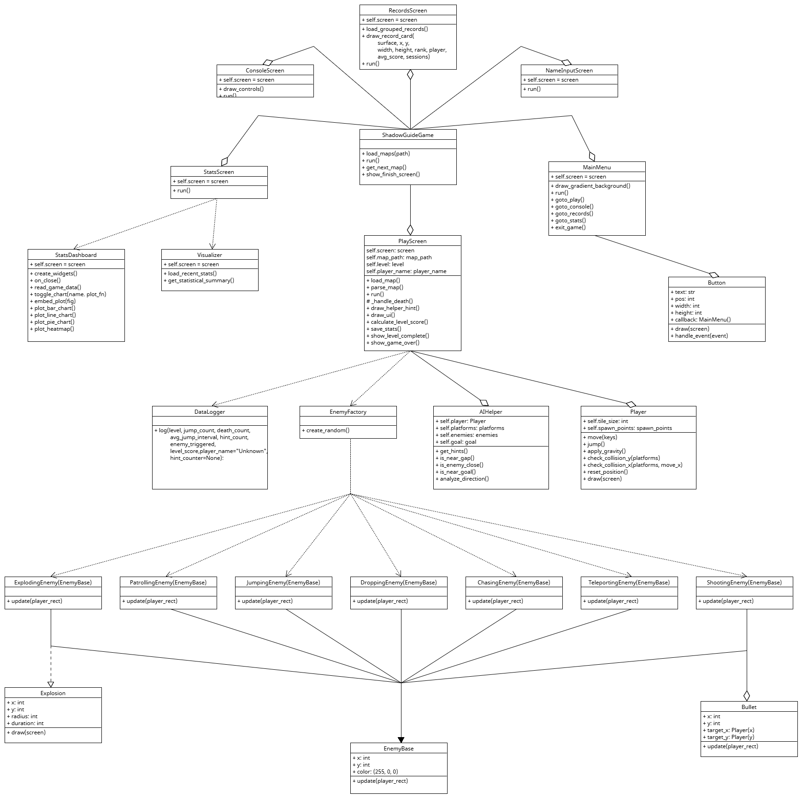

# Shadow Guide - Game Architecture Description

## 🎮 Game Overview

Shadow Guide is a 2D platformer where players navigate levels filled with enemies and obstacles.  
Unlike traditional platformers, this game includes an **AI Helper** that analyzes the player's performance in real-time and provides adaptive hints to improve gameplay.

---

## 🧱 Core Components

### `main.py`
- Acts as the **entry point** of the game.
- Manages screen transitions (`MainMenu`, `PlayScreen`, `StatsScreen`, etc.)
- Loads level maps and tracks current progress.

---

## 👤 `Player` Class
Located in: `player.py`
- Handles player movement, jump logic, energy system, and dash mechanic.
- Attributes:
  - `energy`, `jump_count`, `on_ground`, `rect`
- Methods:
  - `move()`, `jump()`, `apply_gravity()`, `check_collision_x/y()`

---

## 👾 `Enemy` System
Located in: `enemy.py`, `enemy_factory.py`
- **Base class:** `EnemyBase`
- Derived types:
  - `PatrollingEnemy`, `ChasingEnemy`, `JumpingEnemy`
  - `ShootingEnemy`, `ExplodingEnemy`, `TeleportingEnemy`, `DroppingEnemy`
- **Factory:** `EnemyFactory` uses level difficulty to spawn a weighted enemy type

---

## 🧨 `Explosion`
Located in: `explosion.py`
- Simple class to visually show a blast radius with fade-out effect.
- Used by `ExplodingEnemy`

---

## 💡 `AIHelper`
Located in: `ai_helper.py`
- Analyzes player position vs obstacles/enemies
- Provides hints such as:
  - `"Jump Now!"`, `"Go Left!"`, `"Enemy Close!"`
- Counts hint by type → used for stats/graphs

---

## 🗺️ `PlayScreen`
Located in: `play_screen.py`
- Core gameplay loop
- Handles map loading, enemy updates, collisions, goal checking
- Tracks performance metrics:
  - `jump_count`, `death_count`, `avg_jump_interval`, `level_score`, `hint_count`
- Saves data to `game_data.csv` via `DataLogger`

---

## 📊 Statistics System

### `data_logger.py`
- Logs each gameplay session to `game_data.csv`
- Columns include `level`, `score`, `hint types`, `enemy_triggered`, etc.

### `visualize_data.py`
- Provides back-end logic to:
  - Show recent session
  - Calculate summary stats (mean, min, max)
  - Generate graphs (bar, pie, heatmap)

### `stats_screen.py`
- UI for stats page with toggle buttons:
  - Recent
  - Summary
  - Overall (calls embedded Matplotlib window)

### `stats_dashboard.py`
- Tkinter-based interactive graph window (bar, line, pie, heatmap)

---

## 📂 UI Screens

- `main_menu.py`: gradient menu with 5 buttons
- `console_screen.py`: how-to-play & controls
- `records_screen.py`: shows top players by average score
- `name_input_screen.py`: enter player name before starting game

---

## 🧠 Algorithms Used

- **Decision Trees (manual)** for hint logic (in `AIHelper`)
- Future support for ML models via CSV for training

---

## ✅ Summary

Shadow Guide combines precise movement, dynamic AI hinting, and enemy challenges in an adaptive platforming experience. The architecture supports modular UI, expandable enemy types, and deep player analytics.

---

## 🧩 UML Class Diagram

---

## 🎥 Demo Video

Watch our gameplay demo here:  
[📺 YouTube - Shadow Guide](https://youtu.be/diJnR30bZtI)

---